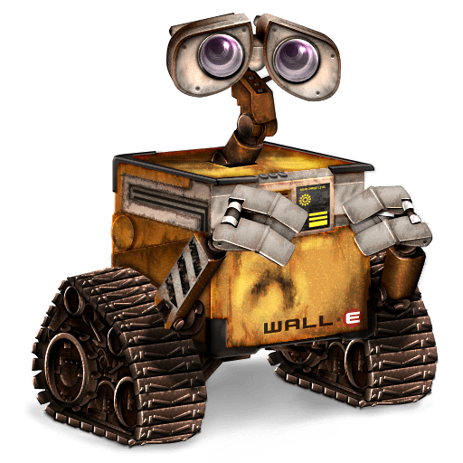

### Hey, I'm Maanav 👋

I write software at [Canonical](https://canonical.com), mostly around Linux 🐧, containers, and packaging.
Before that: an M.S. at Stony Brook and some time building robots that tried not to drive into walls .

Outside of code I'm love to ski and read about mythical beasts.

[LinkedIn](https://www.linkedin.com/in/maanava/) · [Email](mailto:maanavanandkumar@gmail.com)
